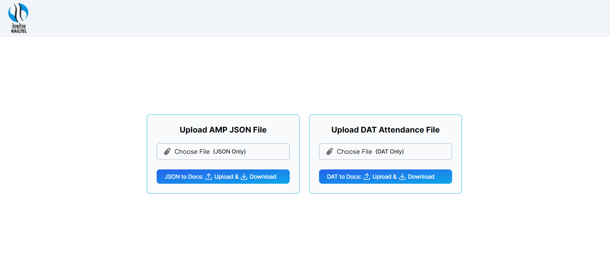

# SOC WEB APPS portal of RailTel Corporation of India Ltd.

## Introduction:

This is a portal for all the Small web Apps like

- Attendance Management System: Attendance getting from essl attendance management system in dat file. getting only id and date time from dat file, then

  - add name associated with that id.
  - as well as date, time in, time out, status whether has come before 9:30 AM or not, num of hours he has worked,
  - daily status of ontime overtime or late.

- CISCO AMP JSON to extract only required data from it and download in excel sheet.generally json file size exeeded 40,000 lines. that's why this is important app to get only required data within second.

## Usage

- ### Home page

  

## Technology Stacks:

- [React](https://react.dev/) - A JavaScript library for building user interfaces
- [Next.js](https://nextjs.org/) - for frontend and backend development.
- [mysql2](https://sidorares.github.io/node-mysql2/docs) - MySQL client for Node.js.
- [tailwindcss](https://tailwindcss.com/) - A utility-first CSS framework.

## Folder Structure:

- route in app/
- api in app/api/

## Installation:

```bash
npm install //install all packages
npm run dev //start the project
```
